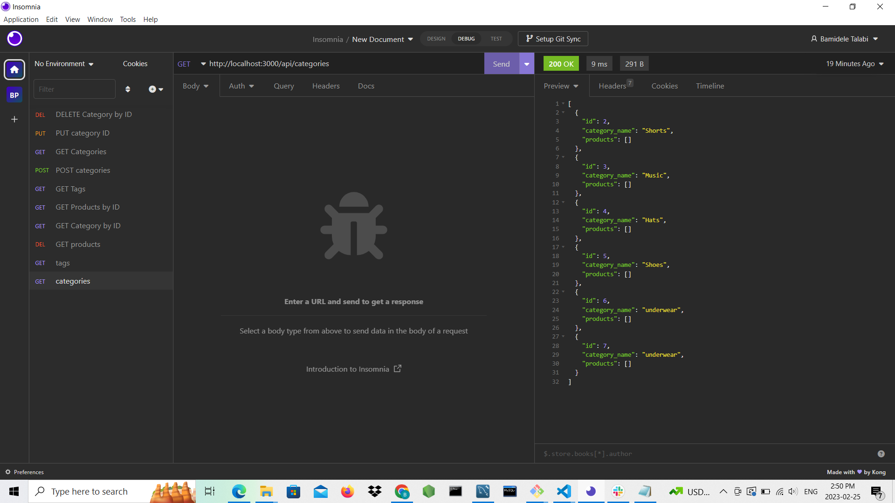
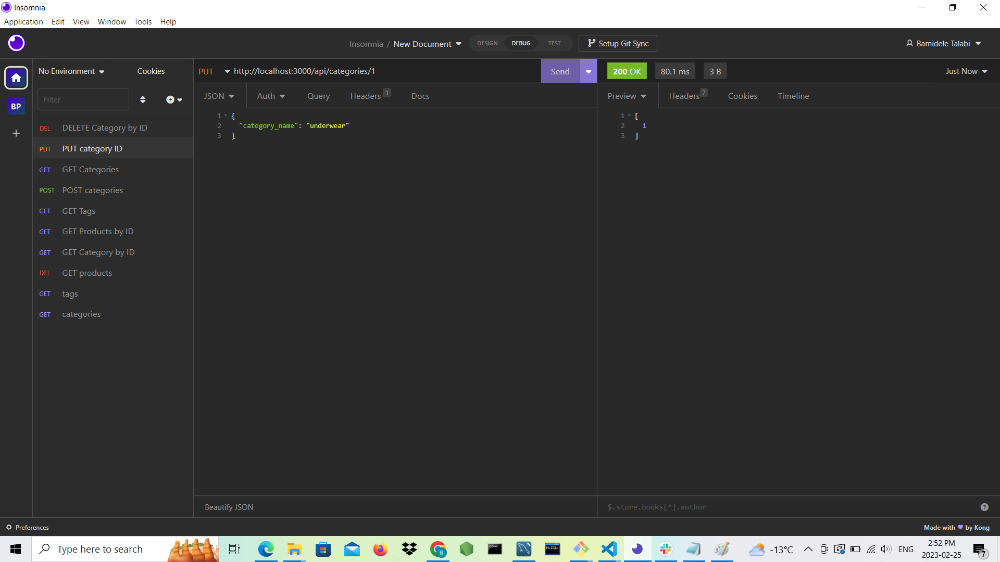

# E-Commerce Back End

## Description
The E-commerce Back End task is about 
The task here is about E-commerce platforms like WooCommerce and Shopify given a starter code and ask to modify the codes to work at back-end with Express.js API, Sequelize to interact with MYSQK database. Having modified the codes to work at the back-end, the codes are tested with Insomnia for GET, POST, PUT and DELETE functions.

## Built With
Javascript
NodeJS
Sequelize/MYSQL2
Nodemon

## Generated images

## Deployed URL and Repository
https://github.com/Bamidele100/e-commerce-backend-app.git
